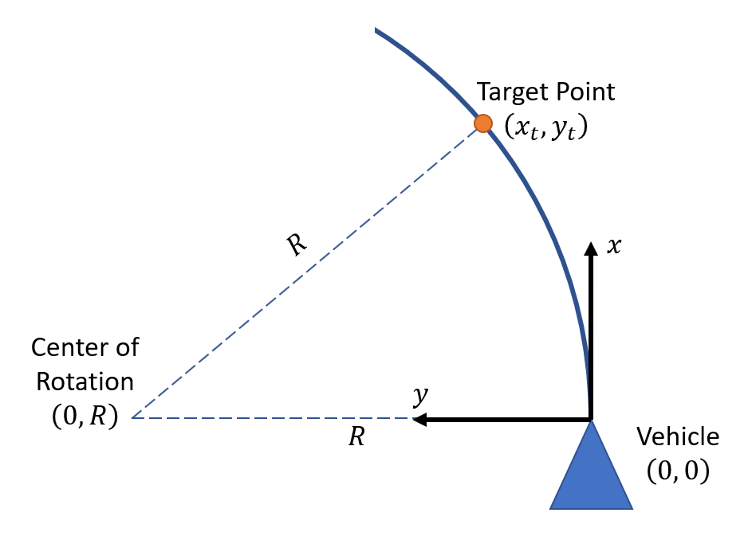

# ECE 6460 Homework #2
The goal of this assignment is to re-implement the trajectory following module from the reference design that was run for Homework #1.

The purpose of this assignment is to:

- Become familiar with how to send actuation commands to the simulation of the Dataspeed ADAS Kit CAN interface
- Practice converting latitude and longitude into Cartesian coordinates for navigation

## Due Date
This assignment is due on Sunday, October 13th at midnight.

## Provided Files
After accepting the assignment on GitHub Classroom, the student's assignment repository will be initialized with the following files:

- `package.xml` and `CMakeLists.txt` files for the `homework2` package.
- Starting point of `homework2.launch` to be modified as part of the assignment:
  - `launch/homework2.launch`
- Template C++ files to be modified as part of the assignment:
	- `src/homework2_node.cpp`
	- `src/Homework2.cpp`
	- `src/Homework2.hpp`
- Dynamic parameter configuration file
	- `cfg/Homework2.cfg`
- Simulation scenario config file
	- `yaml/homework2_scenario.yaml`
- Test configuration files in the `tests` folder of the `homework2` package

## Requirements
Modify the starting files for the `homework2` node to implement the following requirements. The breakdown of the number of grading points is shown in square brackets.
### 1. Advertise and Subscribe to Required Topics [15 / 100]
- [5 / 15] Subscribe to the `/vehicle/perfect_gps/enhanced_fix` topic, which is of type `gps_common/GPSFix`.
	- Messages on this topic contain the vehicle's position in latitude and longitude, as well as its heading in the North-East-Down reference frame.
	- Messages are published to this topic at a rate of 50 Hz.
- [5 / 15] Subscribe to the `/lookahead_trajectory` topic, which is of type `avs_lecture_msgs/Trajectory`.
	- The `points` field of messages on this topic contain an array of waypoints that represent the upcoming section of the desired route.
	- Each waypoint is represented in raw UTM coordinates.
	- Messages are published to this topic at a rate of 1 Hz.
- [5 / 15] Advertise the `/vehicle/ulc_cmd` topic with type `dataspeed_ulc_msgs/UlcCmd`.
	- Messages must be published on this topic at a minimum rate of 50Hz.

### 2. Implement and Run Control Algorithm [60 / 100]
- [50 / 60] Implement a control algorithm to follow the incoming waypoint trajectory with a maximum lateral offset of 30cm.
- [10 / 60] Modify `homework2.launch` to run the `homework2` node.

### 3. Pass Automated Tests [25 / 100]
Make sure the automated test script runs and reports that all tests passed. The test script makes sure that the vehicle does not excessively violate the 30 cm lateral offset requirement.

## Hints
- A simple but effective way to steer along a path is to select one of the waypoints and input its coordinates into the control algorithm
- The selection of the target point has a large effect on the resulting path following performance
- It is highly recommended to compute the waypoint positions relative to the vehicle's reference frame whenever a new GPS fix message is received

## Curvature-Based Algorithm

The turning radius to hit the target point can be computed in terms of the target point's coordinates in the vehicle's reference frame:

To avoid numerical problems for small values of y_t, and because the ULC steering control interface is curvature based, it is therefore better to compute curvature instead of turning radius:

